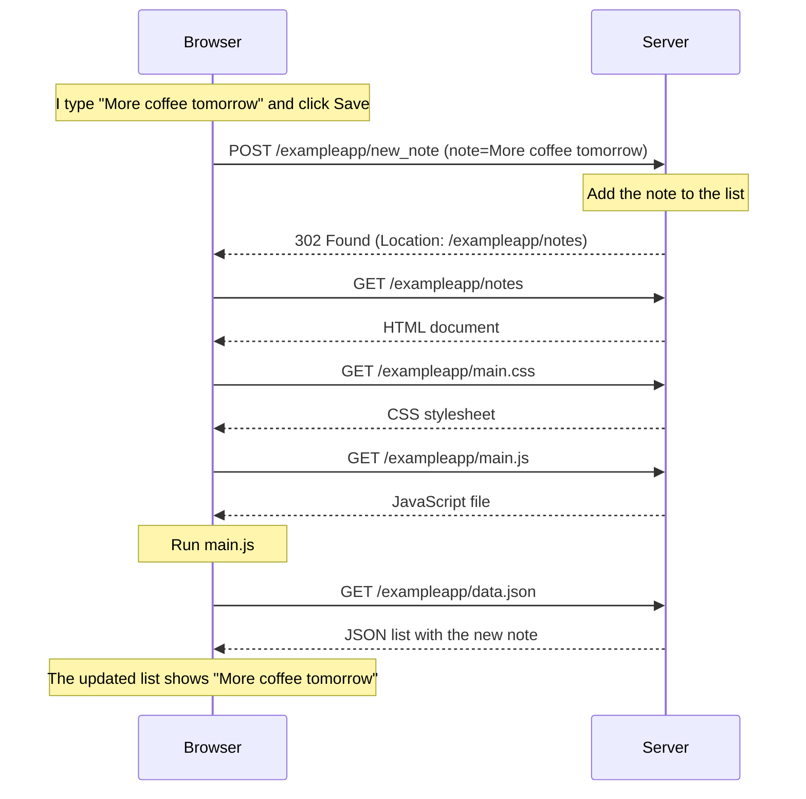

# Full Stack Open — 0.4 New note diagram

```mermaid
sequenceDiagram
    participant Browser
    participant Server

    Note over Browser: I type "More coffee tomorrow" and click Save
    Browser->>Server: POST /exampleapp/new_note (note=More coffee tomorrow)
    Note over Server: Add the note to the list
    Server-->>Browser: 302 Found (Location: /exampleapp/notes)

    Browser->>Server: GET /exampleapp/notes
    Server-->>Browser: HTML document

    Browser->>Server: GET /exampleapp/main.css
    Server-->>Browser: CSS stylesheet

    Browser->>Server: GET /exampleapp/main.js
    Server-->>Browser: JavaScript file

    Note over Browser: Run main.js
    Browser->>Server: GET /exampleapp/data.json
    Server-->>Browser: JSON list with the new note
    Note over Browser: The updated list shows "More coffee tomorrow"
```
