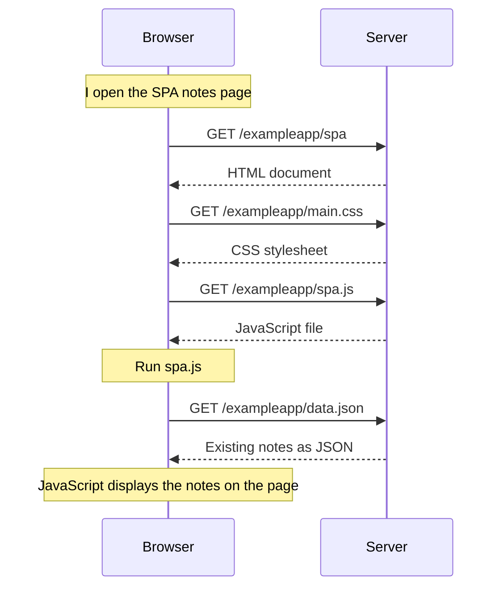

# Full Stack Open — 0.5 Single page app diagram

```mermaid
sequenceDiagram
    participant Browser
    participant Server

    Note over Browser: I open the SPA notes page
    Browser->>Server: GET /exampleapp/spa
    Server-->>Browser: HTML document

    Browser->>Server: GET /exampleapp/main.css
    Server-->>Browser: CSS stylesheet

    Browser->>Server: GET /exampleapp/spa.js
    Server-->>Browser: JavaScript file

    Note over Browser: Run spa.js
    Browser->>Server: GET /exampleapp/data.json
    Server-->>Browser: Existing notes as JSON

    Note over Browser: JavaScript displays the notes on the page
```