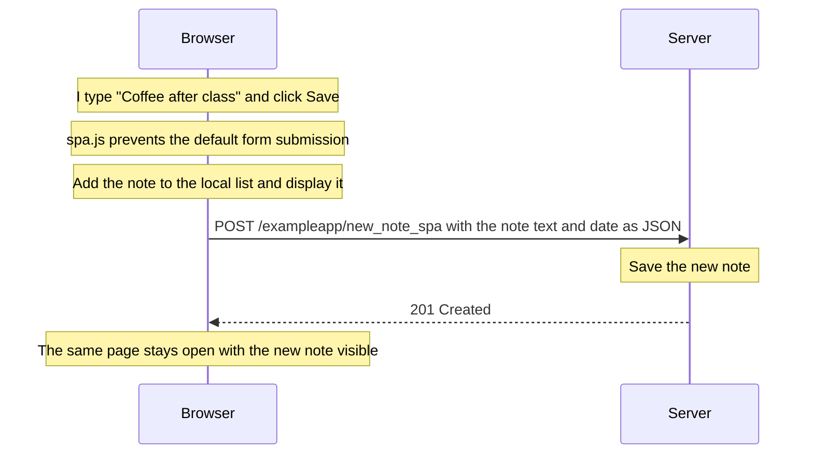

# Full Stack Open — 0.6 New note in the SPA

```mermaid
sequenceDiagram
    participant Browser
    participant Server

    Note over Browser: I type "Coffee after class" and click Save
    Note over Browser: spa.js prevents the default form submission
    Note over Browser: Add the note to the local list and display it
    Browser->>Server: POST /exampleapp/new_note_spa with the note text and date as JSON
    Note over Server: Save the new note
    Server-->>Browser: 201 Created
    Note over Browser: The same page stays open with the new note visible
```